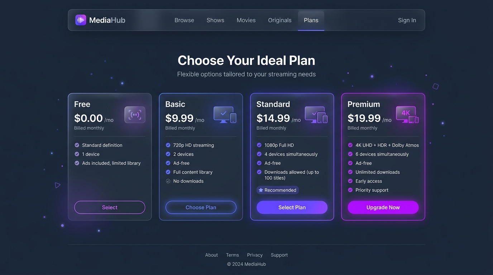
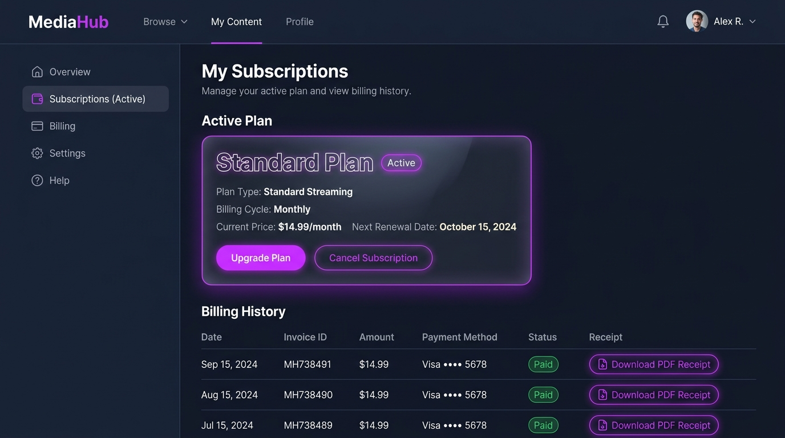
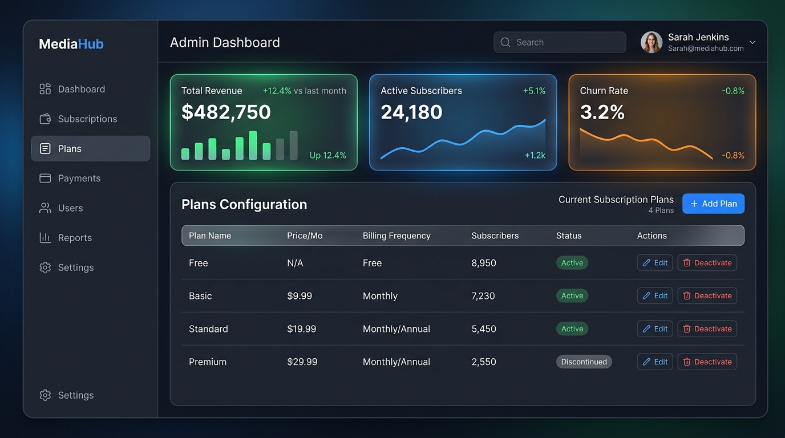

# Figma Mockup Design Specification
## Subscription & Plan Management Module (MediaHub)

This document provides a comprehensive blueprint and visual walkthrough to design and build high-fidelity UI mockups for your **Subscription & Plan Management** module in Figma. It aligns directly with the media platform's dark-slate styling and includes step-by-step layouts for the screens specified in your product documentation.

---

## 🎨 Design Tokens & UI System

To achieve a premium, state-of-the-art visual appearance, configure these styling tokens in your Figma library:

### 1. Color Palette
| Palette Type | Hex Code | Figma Style Name | Application |
| :--- | :--- | :--- | :--- |
| **Background (Dark)** | `#0A0B10` | `BG / Dark Base` | Main canvas background |
| **Background (Elevated)** | `#121422` | `BG / Dark Elevated` | Panels, sidebar backgrounds |
| **Accent Primary** | `#6366F1` | `Accent / Indigo` | Active states, primary buttons, borders |
| **Accent Secondary** | `#A855F7` | `Accent / Purple Glow` | Interactive gradients, key text highlights |
| **Status - Success** | `#10B981` | `Status / Success` | Entitlements allowed, Active status badge |
| **Status - Warning** | `#F59E0B` | `Status / Warning` | Expiring soon, Suspended status badge |
| **Status - Danger** | `#EF4444` | `Status / Cancelled` | Expired, Cancelled status badge |
| **Text - Primary** | `#FFFFFF` | `Text / High Contrast` | Titles, values, body |
| **Text - Secondary** | `#94A3B8` | `Text / Muted` | Labels, descriptions |

### 2. Typography
- **Font Family**: `Inter` or `Outfit` (install from Google Fonts if not in Figma)
- **Scale**:
  - `H1 / Page Title`: **28px** | Bold | Letter spacing `-1%`
  - `H2 / Card Header`: **20px** | Semi-Bold
  - `Body / Core text`: **14px** | Regular
  - `Small / Badge labels`: **12px** | Semi-Bold | Uppercase | Letter spacing `5%`

### 3. Glassmorphism Layer Styling (Cards)
- **Fill**: Solid Black `#000000` at **30% Opacity** (or `#FFFFFF` at **2% Opacity**)
- **Stroke**: Solid White `#FFFFFF` at **8% Opacity** (Width: `1px`)
- **Effects**:
  - Background Blur: `24px`
  - Drop Shadow: Color `#000000` | Opacity `25%` | Blur `16px` | Y: `8px`

---

## 🖥️ Screen Layout Walkthroughs

````carousel
### Screen 1: Subscription Plan Catalog (SPM-SUB-01)
**Purpose**: View available plans & details to subscribe.

#### 📐 Figma Layout Guidelines
- **Grid Layout**: 4-column layout for the plan cards, centered with `24px` gutters.
- **Card Structure**:
  - **Header**: Large tag/category title (e.g. `BASIC`, `STANDARD`, `PREMIUM`). Price in large font (e.g. `$9.99/mo`).
  - **Body**: Entitlements checklist with green checkmark indicators (HD, Devices limit, Offline Download status).
  - **Footer**: A full-width glowing button labeled **"Subscribe Now"**.
- **Interactive Component**: Make the card scale up slightly (`1.02x` scale) on Hover using Figma's interactive state transitions.


<!-- slide -->
### Screen 2: Subscription Enrollment (SPM-SUB-02)
**Purpose**: Select payment frequency, start date, and checkout form.

#### 📐 Figma Layout Guidelines
- **Two-Column Split**:
  - **Left Column**: Form inputs (Billing Cycle drop-down, Renewal type selector, Coupon Code text field).
  - **Right Column**: **Order Summary Card** displaying the selected plan entitlements, subtotal price, and coupon discount details.
- **Button**: Interactive glowing checkout button labeled **"Activate entitilements"**.
- **Form Validations**: Mock validation errors (e.g. outline inputs in red `#EF4444` with a text note underneath).
<!-- slide -->
### Screen 3: My Subscriptions Portal (SPM-SUB-03)
**Purpose**: Subscriber dashboard displaying current plan, renewal actions, and invoice receipts history.

#### 📐 Figma Layout Guidelines
- **Main Entitlements Card**: Highlights the currently active subscription, next renewal date, status indicator badge (e.g. active, expired).
- **Actions Bar**: Buttons to **"Upgrade Plan"**, **"Change Payment Method"**, or **"Cancel Plan"**.
- **Billing History**: Clean table listing past payments (Date, Amount, Plan Tier, Download Receipt icon button).


<!-- slide -->
### Screen 4: Admin Plan Configuration Dashboard (SPM-ADM-01)
**Purpose**: Media admin dashboard to create, modify, and monitor performance of plans.

#### 📐 Figma Layout Guidelines
- **Top Row Statistics Cards**: Displaying active metrics (Active Subscribers, Monthly Revenue, Entitlement Count).
- **Primary Action**: A prominent violet **"+ Add New Plan"** button at the top-right.
- **Data Table**: Displays a list of current subscription templates with sorting options, showing Plan Name, Price, Cycle, Status (`Active` / `Discontinued`), and edit dropdown controls.


<!-- slide -->
### Screen 5: Admin Subscriber Entitlement Control (SPM-ADM-02)
**Purpose**: Modify specific subscriber accounts (used to suspend or reactivate plans for breach of usage policy).

#### 📐 Figma Layout Guidelines
- **User Detail Header**: Shows name, email, account register date, and profile picture placeholder.
- **Active Subscription entitilements grid**: Displays device lists, IP locations, and active session tokens.
- **Override Actions Panel**: Dedicated buttons to **"Suspend Plan entitlements"** (with modal popup mockup requesting suspension notes) and **"Re-activate Service"**.
````

---

## 🔗 Creating Interactive Figma Prototypes

To create a working demo presentation for your Scrum Master, link these frames together using Figma's **Prototype Mode**:

1. **Plan Selection Interaction**:
   - Select the **"Subscribe Now"** button on the `Standard Plan` card (Screen 1: `/plans`).
   - Create a connection line to the **Subscription Enrollment Screen** (Screen 2).
   - Set Action to: `On Click` -> `Navigate To` -> `Screen 2`.
2. **Checkout Activation Flow**:
   - Select the **"Activate entitlements"** button on Screen 2.
   - Link it to the **My Subscriptions Portal** (Screen 3).
   - Use transition: `Smart Animate` -> `Ease Out (300ms)` to mimic modern page loads.
3. **Upgrade Path Interaction**:
   - Link the **"Upgrade Plan"** button on Screen 3 back to the `/plans` page (Screen 1), showing higher tiers.
4. **Admin Route Flow**:
   - Set up an entry point inside your admin console to navigate directly to Screen 4 (Subscription Management Dashboard). Link the table edit buttons to a slide-over modal for plan creation.
